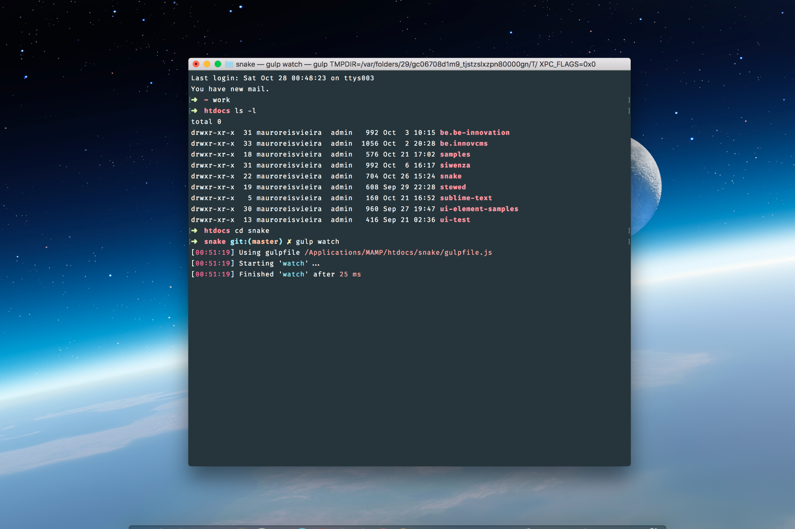
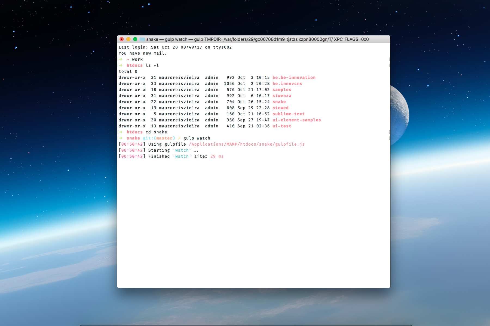
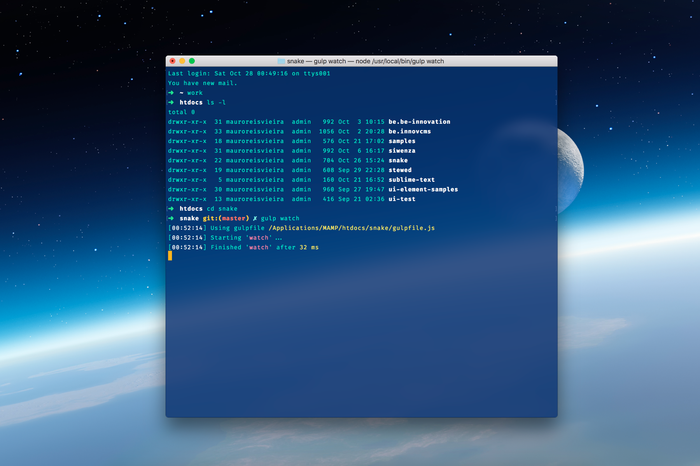
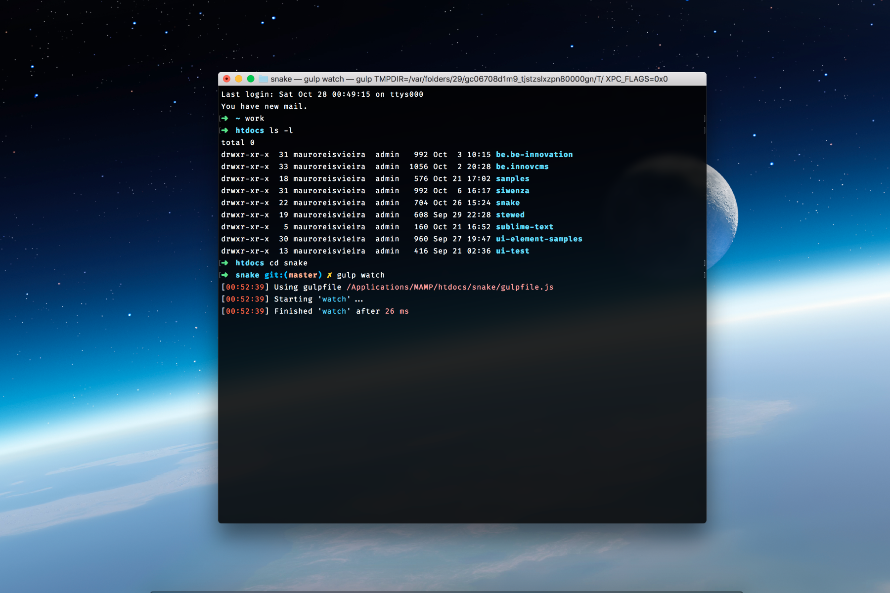

# Material Theme for OSX Shell 🎉


This theme for **OSX Shell** is based on color from [Google Material Design](http://www.google.com/design/).

## Material Theme
<div align="center">
    
</div>

---

## Material Theme Light
<div align="center">
    
</div>

---

## Material Theme Infinity
<div align="center">
    
</div>

---

## Material Theme Dark
<div align="center">
    
</div>

---

### Font

`Material Theme for OSX Shell` uses [__Roboto Mono__](https://www.google.com/fonts/specimen/Roboto+Mono) as main font and it's highly recommended to install it to get monospaced font.

### Clone the repo using Git

```bash
git clone https://github.com/maurovieirareis/osx-shell-theme
```

### Installation

1. Open your OSX Terminal.
2. Go to `Preferences`.
3. Click in `Profile` tab.
4. Import the Themes.
5. Done! :)

Alternatively you can [download](https://codeload.github.com/maurovieirareis/osx-shell-theme/zip/master) this repository.

Created with ♥️ by [@mauroreisvieira](https://twitter.com/mauroreisvieira) in **Portugal**


